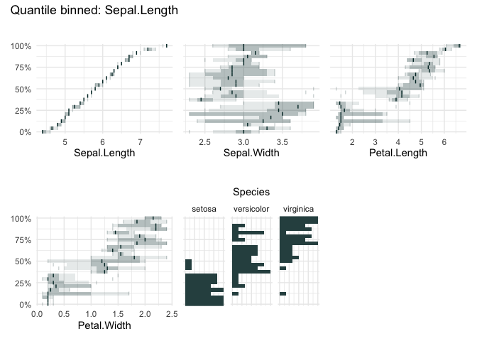
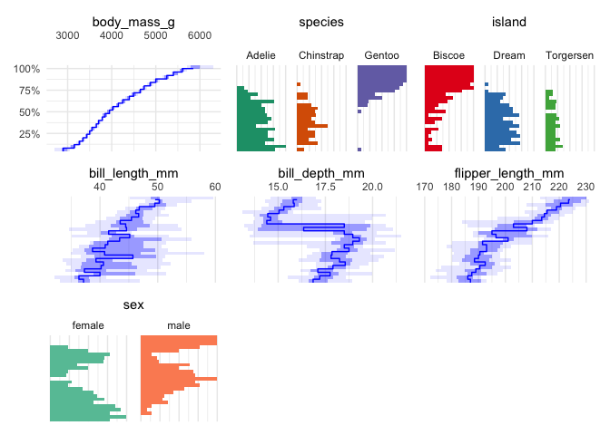
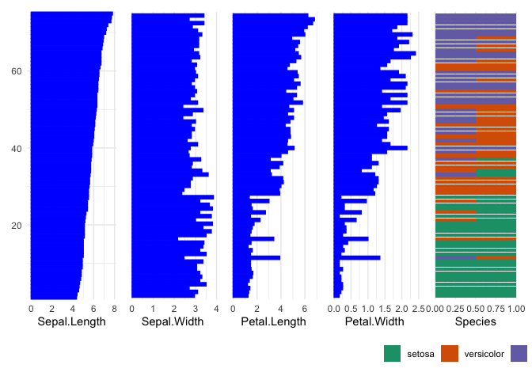
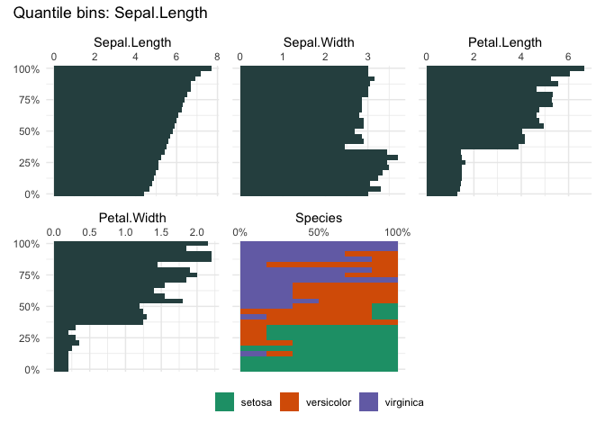

<!-- README.md is generated from README.Rmd. Please edit that file -->

# ggtableplot

<!-- badges: start -->

[](https://CRAN.R-project.org/package=ggtableplot)
[](https://github.com/edwindj/ggtableplot/actions/workflows/R-CMD-check.yaml)

<!-- badges: end -->

This package is in its early stages, not ready for production yet.

## Installation

You can install the development version of ggtableplot from
[GitHub](https://github.com/) with:

``` r
remotes::install_github("edwindj/ggtableplot")
```

## Example

``` r
library(ggtableplot)
#> Loading required package: ggplot2
## basic example code
```

A percentile plot…

``` r
percentile_dep_plot(iris, "Sepal.Length", 25)
```



``` r
library(palmerpenguins)
percentile_dep_plot(penguins[1:7], c("body_mass_g"), 25)
```



``` r
ggtableplot(iris, "Sepal.Length", 75)
```



Or the well-known `diamonds` dataset

``` r
data("diamonds", package = "ggplot2")
ggtableplot(diamonds, "carat", ncols=4)
```


