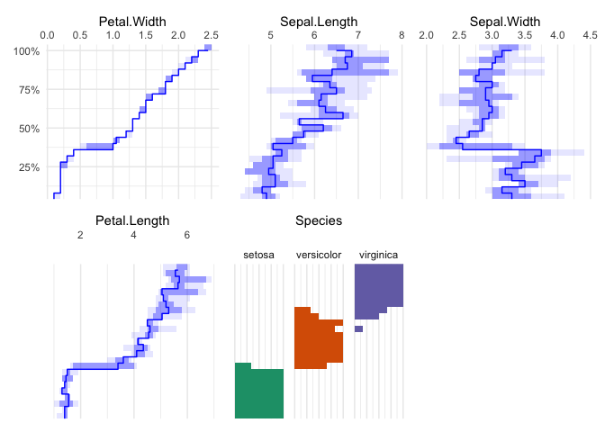
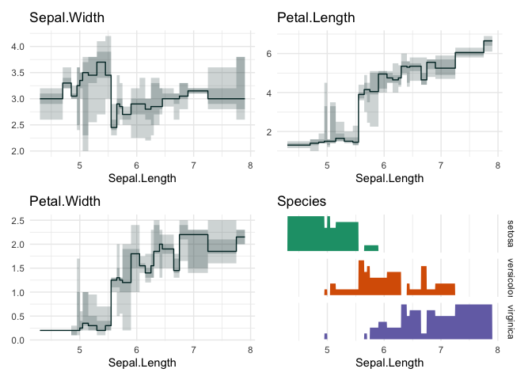
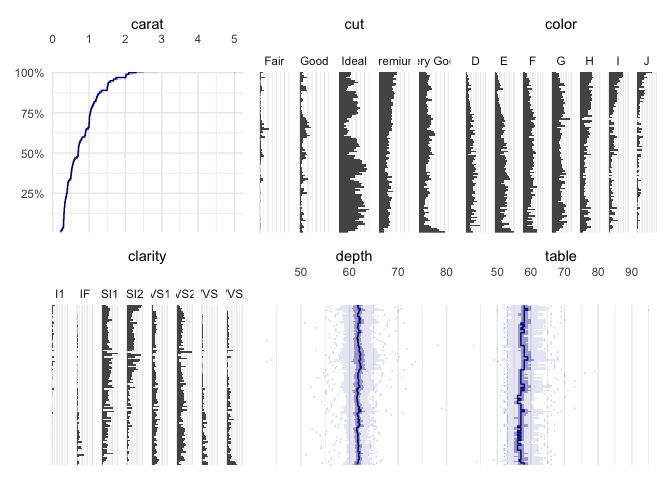
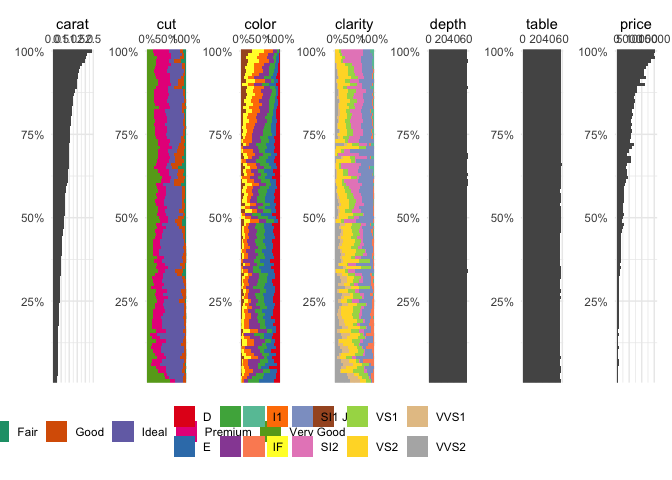

<!-- README.md is generated from README.Rmd. Please edit that file -->

# quantdepplot

<!-- badges: start -->

[](https://CRAN.R-project.org/package=quantdepplot)
[](https://github.com/edwindj/quantdepplot/actions/workflows/R-CMD-check.yaml)

<!-- badges: end -->

This package is in its early stages, not ready for production yet.

## Installation

You can install the development version of quantdepplot from
[GitHub](https://github.com/) with:

``` r
remotes::install_github("edwindj/quantdepplot")
```

## Example

``` r
library(quantdepplot)
#> Loading required package: ggplot2
## basic example code
```

A quantile dependence plot

``` r
quantile_dependence_plot(iris, "Sepal.Length", 25)
```


vs

``` r
table_plot(iris, "Sepal.Length", 25)
```


``` r
quantile_dependence_plot(iris, "Petal.Width", 25)
```



``` r
library(palmerpenguins)
quantile_dependence_plot(penguins[1:7], c("body_mass_g"), 25)
```


``` r
table_plot(iris, "Sepal.Length", 75)
#> 'n' is larger then nrows/5 ('min_bin_size'), setting 'n' to: 30
```


Or the well-known `diamonds` dataset

``` r
data("diamonds", package = "ggplot2")
table_plot(diamonds, "carat", ncols=4)
```



``` r
data("diamonds", package = "ggplot2")
quantile_dependence_plot(diamonds[1:6], "carat", ncols=3)
```



``` r
dependence_plot(diamonds, "price")
```


