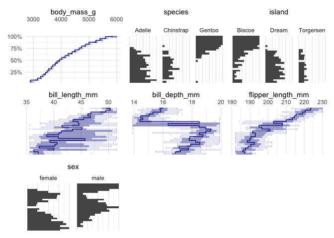
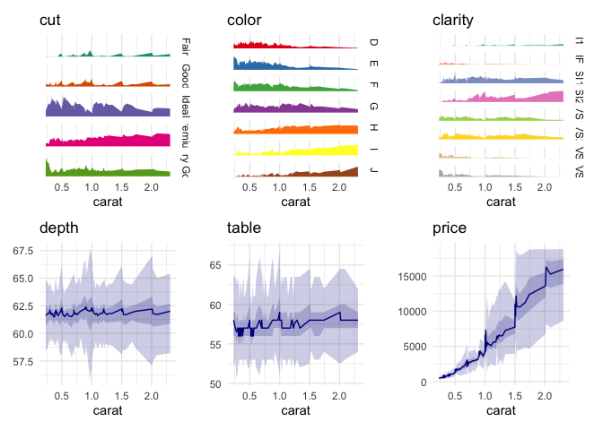
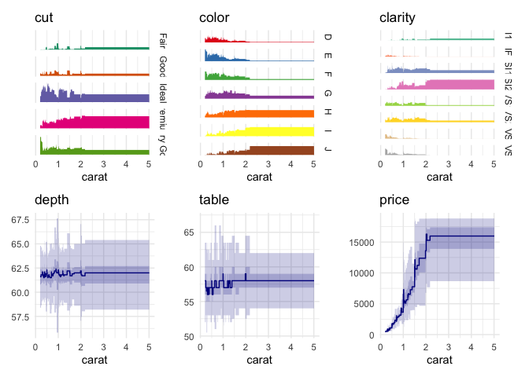
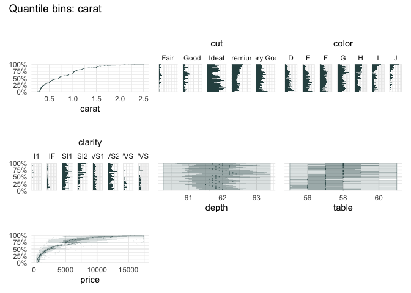

<!-- README.md is generated from README.Rmd. Please edit that file -->

# qbinplot

<!-- badges: start -->

[](https://CRAN.R-project.org/package=qbinplot)
[](https://github.com/edwindj/qbinplot/actions/workflows/R-CMD-check.yaml)

<!-- badges: end -->

This package is in its early stages, not ready for production yet.

## Installation

You can install the development version of `qbinplot` from
[GitHub](https://github.com/) with:

``` r
remotes::install_github("edwindj/qbinplot")
```

## Example

``` r
library(qbinplot)
#> Loading required package: ggplot2
## basic example code
```

A quantile binning boxplot

``` r
qbin_boxplot(iris, "Sepal.Length", n = 25, auto_fill = TRUE)
```


vs

A quantile binning barplot

``` r
qbin_barplot(iris, "Sepal.Length", 25, auto_fill = TRUE)
```


``` r
table_plot(iris, "Sepal.Length", 25, auto_fill = TRUE)
```


``` r
funq_plot(iris, "Sepal.Length", 25, auto_fill = TRUE)
```


Choosing “Petal.Width”

``` r
qbin_boxplot(iris, "Petal.Width", 25, auto_fill = TRUE)
```


``` r
library(palmerpenguins)
qbin_boxplot(penguins[1:7], c("body_mass_g"), 25)
```



Or the well-known `diamonds` dataset

``` r
data("diamonds", package = "ggplot2")
table_plot(diamonds[1:7], "carat")
```


``` r
data("diamonds", package = "ggplot2")
qbin_boxplot(diamonds[1:7], "carat")
```



``` r
funq_plot(diamonds[1:7], "carat")
```


We can zoom in on the `carat` variable, because the upper quantile bins
are not very informative.

``` r
funq_plot(
  diamonds[1:7], 
  "carat", 
  auto_fill = TRUE,
  xlim = c(0, 2.5)
)
```



``` r
qbin_heatmap(
  iris,
  x = "Sepal.Length",
  n = 25
)
```


