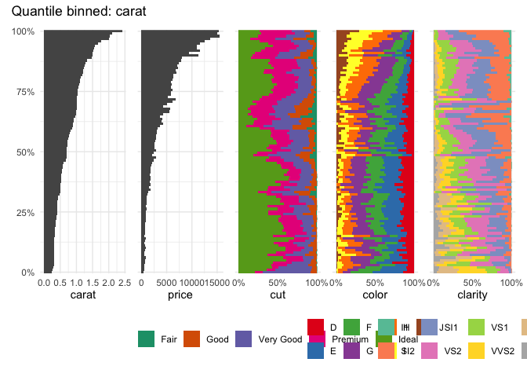
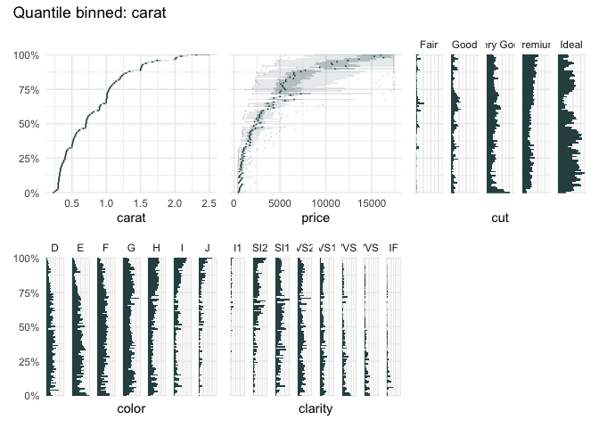
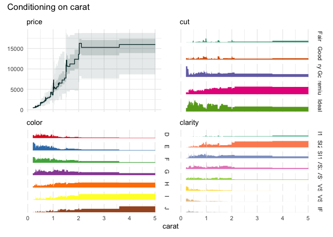
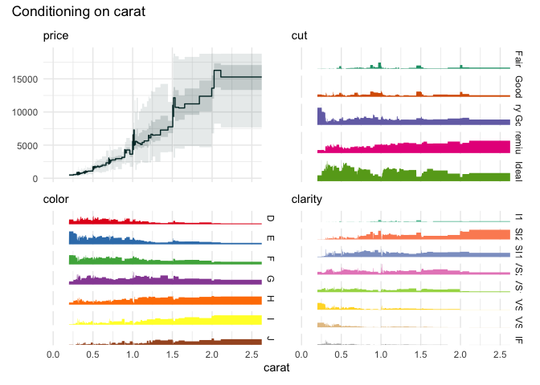

<!-- README.md is generated from README.Rmd. Please edit that file -->

# qbinplots

<!-- badges: start -->

[](https://CRAN.R-project.org/package=qbinplots)
[](https://github.com/edwindj/qbinplots/actions/workflows/R-CMD-check.yaml)
[](https://lifecycle.r-lib.org/articles/stages.html#experimental)
<!-- badges: end -->

<!-- This package is in its early stages, not ready for production yet. -->

This package creates plots using quantile binning. Quantile binning is
an exploratory data analysis tool that helps to see the distribution of
the variables in a dataset as a function of the variable that is binned.

## Installation

You can install the released version of `qbinplots` from
[CRAN](https://CRAN.R-project.org) with:

``` r
install.packages("qbinplots")
```

You can install the development version of `qbinplots` from
[GitHub](https://github.com/) with:

``` r
remotes::install_github("edwindj/qbinplots")
```

## Example

``` r
library(qbinplots)
## basic example code
```

A quantile binning boxplot

``` r
qbin_boxplot(iris, "Sepal.Length", n = 12)
```


vs

A quantile binning barplot

``` r
qbin_barplot(iris, "Sepal.Length", n = 12)
```


``` r
table_plot(iris, "Sepal.Length", n=12)
```


vs

A quantile binning heatmap

``` r
qbin_heatmap(iris, "Sepal.Length", n=12, auto_fill = TRUE)
```


``` r
cond_boxplot(iris, "Sepal.Length", n=12, auto_fill = TRUE)
```


``` r
cond_barplot(iris, "Sepal.Length", n=12, auto_fill = TRUE)
```


``` r
funq_plot(iris, "Sepal.Length", 12, auto_fill = TRUE)
```


``` r
funq_plot(iris, "Sepal.Length", overlap = TRUE, min_bin_size = 20)
```


Choosing “Petal.Width”

``` r
funq_plot(iris, "Petal.Width", n=12)
```


``` r
library(palmerpenguins)
qbin_lineplot(penguins[1:7], x="body_mass_g", n = 19, ncols = 4)
```


Or the well-known `diamonds` dataset

``` r
data("diamonds", package = "ggplot2")
table_plot(diamonds[1:7], "carat")
```



``` r
data("diamonds", package = "ggplot2")
qbin_boxplot(diamonds[1:7], "carat")
```



``` r
funq_plot(diamonds[1:7], "carat")
```



We can zoom in on the `carat` variable, because the upper quantile bins
are not very informative.

``` r
funq_plot(
  diamonds[1:7], 
  "carat", 
  auto_fill = TRUE,
  xlim = c(0, 2.5)
)
```



``` r
qbin_heatmap(
  iris,
  x = "Sepal.Length",
  n = 12,
  type="s"
)
```


``` r
qbin_heatmap(
  iris,
  x = "Sepal.Length",
  overlap = TRUE
)
```


